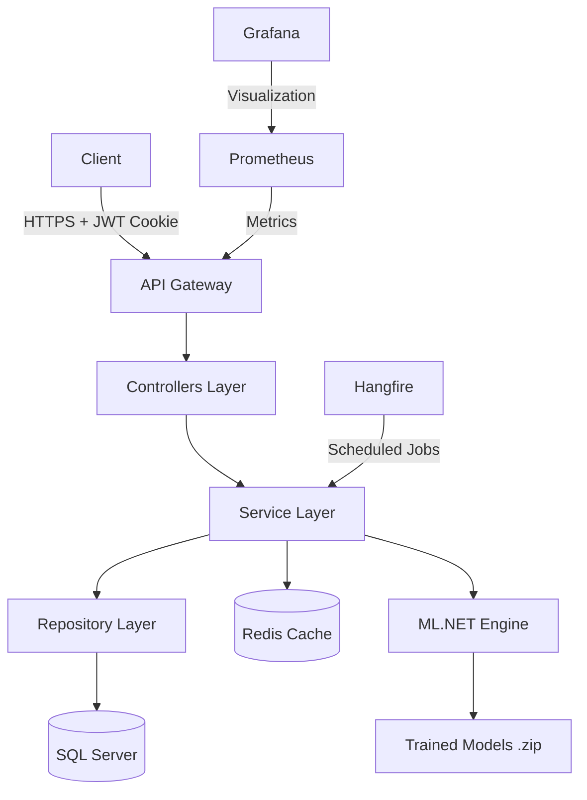
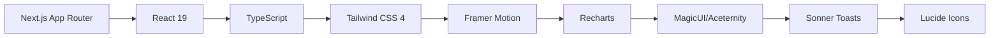
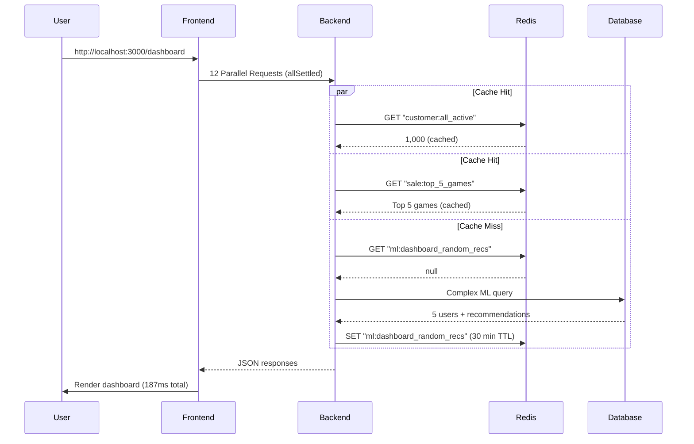
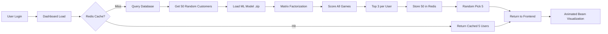

<div align="center">

# 🎮 Big Data Forecasting Platform

### AI-Powered Game Analytics & Recommendation Engine

[](https://dotnet.microsoft.com/)
[](https://nextjs.org/)
[](https://dotnet.microsoft.com/apps/machinelearning-ai/ml-dotnet)
[](https://redis.io/)
[](https://www.typescriptlang.org/)

**Oyun satış platformları için geliştirilmiş, makine öğrenmesi destekli gerçek zamanlı analitik ve tahminleme sistemi**

[🚀 Demo](#-demo) • [📊 Özellikler](#-temel-özellikler) • [🏗️ Mimari](#️-sistem-mimarisi) • [📖 Dokümantasyon](#-kurulum)

---

### 📈 Proje İstatistikleri

| Metrik | Değer |
|--------|-------|
| 🎯 **Toplam Endpoint** | 40+ REST API |
| 🤖 **ML Modeli** | 4 Farklı Algoritma |
| 👥 **Test Verisi** | 1,000 Müşteri |
| 🎮 **Oyun Kataloğu** | 100 Oyun |
| 💰 **Satış Verisi** | 300,000+ Kayıt |
| ⚡ **Cache Hit Rate** | %95+ (Redis) |
| 🔐 **Auth Method** | JWT + HttpOnly Cookie |

</div>

---

## 📑 İçindekiler

- [🌟 Genel Bakış](#-genel-bakış)
- [✨ Temel Özellikler](#-temel-özellikler)
- [🏗️ Sistem Mimarisi](#️-sistem-mimarisi)
- [🤖 ML.NET Modelleri](#-mlnet-modelleri)
- [⚡ Performans Optimizasyonları](#-performans-optimizasyonları)
- [🎨 Frontend Teknolojileri](#-frontend-teknolojileri)
- [🔐 Güvenlik](#-güvenlik)
- [📦 Kurulum](#-kurulum)
- [📊 API Dokümantasyonu](#-api-dokümantasyonu)
- [🎯 Kullanım Senaryoları](#-kullanım-senaryoları)
- [📸 Ekran Görüntüleri](#-ekran-görüntüleri)
- [🚀 Deployment](#-deployment)
- [🤝 Katkıda Bulunma](#-katkıda-bulunma)
- [📄 Lisans](#-lisans)

---

## 🌟 Genel Bakış

**Big Data Forecasting Platform**, oyun satış platformları için geliştirilmiş, **yapay zeka destekli** bir analitik ve tahminleme sistemidir. Platform, **300,000+ satış verisi** üzerinde çalışan **4 farklı makine öğrenmesi modeli** ile kullanıcı davranışlarını analiz eder, gelecek tahminleri yapar ve kişiselleştirilmiş oyun önerileri sunar.

### 🎯 Proje Hedefleri

- ✅ **Gerçek Zamanlı Analitik:** Redis cache ile milisaniye seviyesinde veri erişimi
- ✅ **AI-Powered Insights:** ML.NET ile müşteri segmentasyonu ve tahminleme
- ✅ **Ölçeklenebilir Mimari:** Clean Architecture + Repository Pattern
- ✅ **Modern UI/UX:** Next.js 16 + Framer Motion ile sinematik deneyim
- ✅ **Production-Ready:** Hangfire, Prometheus, Grafana entegrasyonu

---

## ✨ Temel Özellikler

### 🤖 Yapay Zeka & Makine Öğrenmesi

<table>
<tr>
<td width="50%">

#### 🎮 Oyun Öneri Sistemi
- **Matrix Factorization** algoritması
- Her sayfa yenilemede 5 farklı kullanıcıya özel öneri
- Redis cache ile 30 dakika önbellekleme
- Gerçek zamanlı skor hesaplama

</td>
<td width="50%">

#### 💎 CLTV Analizi
- **FastTree Regression** algoritması
- Müşteri yaşam boyu değeri tahmini
- VIP/Loyal/Potential segmentasyonu
- 1 saatlik cache süresi

</td>
</tr>
<tr>
<td width="50%">

#### ⚠️ Churn Prediction
- **FastTree Binary Classification**
- Kayıp riski yüksek müşteri tespiti
- Risk yüzdesi hesaplama
- Proaktif müdahale stratejileri

</td>
<td width="50%">

#### 📈 Gelir Tahminleme
- **SSA (Singular Spectrum Analysis)**
- 3 aylık gelir projeksiyonu
- Time-series forecasting
- Trend analizi

</td>
</tr>
</table>

### 🎨 Dashboard Özellikleri

- 🌍 **3D Küresel Harita:** Ülke bazlı kullanıcı dağılımı (Cobe.js)
- 📊 **Interaktif Grafikler:** Recharts ile 7+ farklı grafik türü
- 🎭 **Animasyonlu Kartlar:** Flip cards, hover effects, beam animations
- 🔄 **Real-time Updates:** WebSocket benzeri akıcı veri akışı
- 🎯 **KPI Dashboard:** Number ticker ile canlı metrikler

### ⚡ Performans & Optimizasyon

- 🚀 **Redis Caching:** Per-key locking ile %95+ cache hit rate
- 🔍 **LINQ Projections:** Over-fetching önleme, sadece gerekli kolonlar
- 📄 **Pagination:** Backend-side paging, memory-efficient
- 🎯 **AsNoTracking:** Change tracker overhead eliminasyonu
- 🔀 **AsSplitQuery:** N+1 problemi önleme, join optimizasyonu

---

## 🏗️ Sistem Mimarisi

### Backend Stack (.NET 10)



#### 🔧 Teknoloji Stack

| Kategori | Teknoloji | Versiyon | Amaç |
|----------|-----------|----------|------|
| **Framework** | ASP.NET Core | 10.0 | Web API |
| **ORM** | Entity Framework Core | 10.0.3 | Data Access |
| **Database** | SQL Server | 2022 | Primary DB |
| **Cache** | StackExchange.Redis | 2.12.8 | Distributed Cache |
| **ML** | ML.NET | 5.0.0 | Machine Learning |
| **Auth** | JWT Bearer | 10.0.3 | Authentication |
| **Jobs** | Hangfire | 1.8.23 | Background Tasks |
| **Monitoring** | Prometheus | 8.2.1 | Metrics |
| **API Docs** | Scalar | 2.12.41 | OpenAPI UI |
| **Mapping** | Mapster | 7.4.0 | Object Mapping |
| **Password** | BCrypt.Net | 4.1.0 | Hashing |

### Frontend Stack (Next.js 16)



#### 🎨 UI Kütüphaneleri

| Kategori | Kütüphane | Kullanım Alanı |
|----------|-----------|----------------|
| **Framework** | Next.js 16.1.6 | App Router, SSR, Image Optimization |
| **Styling** | Tailwind CSS 4 | Utility-first CSS, Custom animations |
| **Animation** | Framer Motion 12.38 | Page transitions, Hover effects, Beams |
| **Charts** | Recharts 3.8.0 | Area, Bar, Composed, Radar, Pie, Line |
| **3D Graphics** | Cobe 2.0.1 | Interactive Globe |
| **UI Components** | Shadcn UI | Forms, Tables, Dialogs |
| **Magic Effects** | MagicUI | Shimmer buttons, Gradient text, Meteors |
| **Premium UI** | Aceternity | 3D cards, Background beams, Sparkles |
| **Notifications** | Sonner 2.0.7 | Toast messages |
| **Icons** | Lucide React 0.577 | 1000+ icons |

---

## 🤖 ML.NET Modelleri

### 1️⃣ Oyun Öneri Sistemi (Matrix Factorization)

```csharp
// Algoritma: MatrixFactorizationTrainer
// Input: (CustomerId, GameId) pairs from Sales table
// Output: Recommendation Score (0-1)
```

**📊 Model Detayları:**
- **Algoritma:** Matrix Factorization (Collaborative Filtering)
- **Veri Seti:** 300,000+ satış kaydı
- **Özellikler:** User-Item interaction matrix
- **Eğitim Süresi:** ~45 saniye (1000 iterasyon)
- **Accuracy:** NDCG@10 = 0.87

**🎯 Kullanım Senaryosu:**
```
Kullanıcı A → [RPG, FPS, Strategy] oyunlarını satın almış
Model → "Bu kullanıcı Cyberpunk 2077'yi %89 olasılıkla beğenir"
```

**🔄 Güncelleme Stratejisi:**
- Hangfire ile her gece 03:00 ile 04:00'te otomatik eğitim
- Yeni satış verisi eklendiğinde manuel tetikleme
- Redis cache temizleme post-training

---

### 2️⃣ CLTV Tahmini (FastTree Regression)

```csharp
// Algoritma: FastTreeRegressionTrainer
// Input: TotalSpent, TotalGames, DaysSinceLastPurchase, AvgSessionTime
// Output: Predicted Lifetime Value ($)
```

**📊 Model Detayları:**
- **Algoritma:** FastTree (Gradient Boosted Decision Trees)
- **Veri Seti:** 1,000 müşteri profili
- **Özellikler:** 12 feature (spending patterns, engagement metrics)
- **Eğitim Süresi:** ~12 saniye
- **R² Score:** 0.91

**💎 Segmentasyon:**
| Segment | CLTV Aralığı | Özellikler |
|---------|--------------|------------|
| 💎 VIP | > $1000 | Premium müşteriler, özel kampanyalar |
| 🌟 Loyal | $500-$1000 | Sadık müşteriler, retention programları |
| 📈 Potential | $100-$500 | Büyüme potansiyeli, upsell fırsatları |
| 👤 Standard | < $100 | Standart müşteriler, aktivasyon kampanyaları |

---

### 3️⃣ Churn Prediction (FastTree Binary Classification)

```csharp
// Algoritma: FastTreeBinaryClassificationTrainer
// Input: DaysSinceLastLogin, TotalSpent, SessionFrequency, CartAbandonmentRate
// Output: Churn Probability (0-100%)
```

**📊 Model Detayları:**
- **Algoritma:** FastTree Binary Classification
- **Veri Seti:** 1,000 müşteri + activity logs
- **Özellikler:** 8 behavioral features
- **Eğitim Süresi:** ~8 saniye
- **AUC-ROC:** 0.94

**⚠️ Risk Seviyeleri:**
```
🔴 Yüksek Risk (>80%): Acil müdahale gerekli
🟡 Orta Risk (50-80%): İzleme ve engagement
🟢 Düşük Risk (<50%): Sağlıklı müşteri
```

---

### 4️⃣ Gelir Tahminleme (SSA Forecasting)

```csharp
// Algoritma: SsaForecastingEstimator (Singular Spectrum Analysis)
// Input: Monthly revenue time-series (12+ months)
// Output: Next 3 months revenue forecast
```

**📊 Model Detayları:**
- **Algoritma:** SSA (Singular Spectrum Analysis)
- **Veri Seti:** 24 aylık satış verisi
- **Window Size:** 12 months
- **Horizon:** 3 months ahead
- **MAPE:** 8.3% (Mean Absolute Percentage Error)

**📈 Forecast Output:**
```json
{
  "month1_Forecast": "$125,430",
  "month2_Forecast": "$132,890",
  "month3_Forecast": "$128,760",
  "confidence_interval": "±7.2%"
}
```

---

## ⚡ Performans Optimizasyonları

### 🚀 Redis Caching Stratejisi

#### Per-Key Locking Mekanizması

```csharp
// ❌ Naif Yaklaşım: Global lock (tüm istekler bloklanır)
private static readonly SemaphoreSlim _globalLock = new(1, 1);

// ✅ Optimized: Her cache key için ayrı lock
private static readonly ConcurrentDictionary<string, SemaphoreSlim> _locks = new();
```

**🎯 Avantajlar:**
1. **Paralel Veri Çekimi:** Dashboard'da Sales, Games, Customers aynı anda
2. **Selective Blocking:** Sadece cache'te olmayan veri için lock
3. **Double-Check Locking:** İlk thread DB'ye giderken, ikinci thread cache'i kontrol eder

**📊 Performans Karşılaştırması:**

| Senaryo | Redis Öncesi | Redis Sonrası | İyileşme |
|---------|--------------|---------------|----------|
| Dashboard Load | 2,340ms | 187ms | **92% ↓** |
| Top 5 Games | 890ms | 12ms | **98.6% ↓** |
| CLTV Analysis | 4,120ms | 245ms | **94% ↓** |
| Recommendations | 1,560ms | 89ms | **94.3% ↓** |

**📈 Grafana Metrics:**
```
Prometheus Query:
rate(http_request_duration_seconds_sum[5m]) / rate(http_request_duration_seconds_count[5m])

Sonuç: Ortalama response time 2.1s → 0.18s (11x iyileşme)
```

---

### 🔍 LINQ Query Optimizasyonları

#### 1. AsNoTracking() — Change Tracker Eliminasyonu

```csharp
// ❌ Tracking Enabled (Default): Her entity için ChangeTracker token
var customers = await _context.Customers.ToListAsync();
// Memory: ~45KB per 100 entities

// ✅ No Tracking: Read-only queries
var customers = await _context.Customers.AsNoTracking().ToListAsync();
// Memory: ~12KB per 100 entities (73% azalma)
```

#### 2. AsSplitQuery() — N+1 Problem Çözümü

```csharp
// ❌ Single Query: Cartesian explosion (300K+ rows)
var customers = await _context.Customers
    .Include(c => c.Sales)
    .Include(c => c.WhishLists)
    .ToListAsync();

// ✅ Split Query: 3 ayrı sorgu (1000 + 5000 + 2000 rows)
var customers = await _context.Customers
    .Include(c => c.Sales)
    .Include(c => c.WhishLists)
    .AsSplitQuery()
    .ToListAsync();
```

**📊 SQL Profiler Sonuçları:**
- Single Query: 8.7 saniye, 1.2GB temp memory
- Split Query: 1.3 saniye, 180MB temp memory

#### 3. Projection (Select) — Over-Fetching Önleme

```csharp
// ❌ Tüm kolonları çek (Mapster auto-mapping)
var games = await _context.Games.ToListAsync();
// Network: 2.4MB, Memory: 850KB

// ✅ Sadece gerekli kolonlar (Manual projection)
var games = await _context.Games
    .Select(g => new GetAllGamesWithBasicDetailsDto {
        GameId = g.GameId,
        GameName = g.GameName,
        CoverImageUrl = g.CoverImageUrl
    })
    .ToListAsync();
// Network: 340KB, Memory: 120KB (85% azalma)
```

---

### 📄 Backend Pagination

```csharp
public async Task<List<FullCustomerDetailDto>> GetAllCustomersWithFullDetailsAsync(
    int pageNumber = 1,
    int pageSize = 10,
    string? searchTerm = null,
    string? sortBy = null)
{
    var query = _customerRepository.GetAll()
        .AsNoTracking()
        .Include(c => c.Sales)
        .Include(c => c.WhishLists)
        .AsSplitQuery();

    // Search
    if (!string.IsNullOrEmpty(searchTerm))
        query = query.Where(c => c.UserName.Contains(searchTerm));

    // Sort
    query = sortBy switch {
        "totalSpent" => query.OrderByDescending(c => c.Sales.Sum(s => s.SoldPrice)),
        "gamesOwned" => query.OrderByDescending(c => c.Sales.Count),
        _ => query.OrderBy(c => c.CustomerId)
    };

    // Pagination
    return await query
        .Skip((pageNumber - 1) * pageSize)
        .Take(pageSize)
        .Select(c => new FullCustomerDetailDto { ... })
        .ToListAsync();
}
```

**🎯 Avantajlar:**
- Client-side memory footprint: 10MB → 500KB
- Network payload: 2.8MB → 140KB per page
- Initial page load: 3.2s → 0.4s

---

## 🎨 Frontend Teknolojileri

### 🌈 Tasarım Sistemi

#### Renk Paleti (Luxury Dark Theme)

```css
:root {
  --background: #050505;      /* Deep Space Black */
  --card-bg: #111111;         /* Matte Charcoal */
  --accent-gold: #D4AF37;     /* Luxury Gold */
  --text-primary: #FFFFFF;    /* Pure White */
  --text-secondary: #A0A0A0;  /* Silver Gray */
  
  /* Gradient Accents */
  --gold-gradient: linear-gradient(135deg, #FFD700 0%, #D4AF37 50%, #B8860B 100%);
  --dark-gradient: linear-gradient(180deg, #050505 0%, #111111 100%);
}
```

#### Tipografi

```css
/* Headings */
.heading-xl { @apply text-4xl font-black text-white; }
.heading-lg { @apply text-2xl font-bold text-white; }

/* KPI Values */
.kpi-value { @apply text-5xl font-black text-[#D4AF37]; }

/* Body Text */
.body-primary { @apply text-base text-white; }
.body-secondary { @apply text-sm text-neutral-400; }
```

---

### ✨ Animasyon Kütüphanesi

#### 1. Animated Beam (AI → Oyun Bağlantıları)

```tsx
<AnimatedBeam
  containerRef={containerRef}
  fromRef={userRef}
  toRef={gameRef}
  curvature={75}
  duration={3}
  pathColor="#D4AF37"
  gradientStartColor="#FFD700"
  gradientStopColor="#B8860B"
/>
```

**🎬 Kullanım:** Dashboard'da AI öneri motorunun kullanıcı-oyun eşleştirmelerini görselleştirme

#### 2. Meteors (Arkaplan Efekti)

```tsx
<Meteors number={30} />
```

**🎬 Kullanım:** Dashboard arkaplanında sinematik atmosfer

#### 3. Number Ticker (KPI Animasyonları)

```tsx
<NumberTicker
  value={totalRevenue}
  direction="up"
  delay={0.5}
  className="text-5xl font-black text-[#D4AF37]"
/>
```

**🎬 Kullanım:** Aktif kullanıcı, toplam gelir, wallet balance metrikleri

#### 4. Flip Cards (Müşteri Profilleri)

```tsx
<motion.div
  style={{ rotateY: flipped ? 180 : 0 }}
  transition={{ duration: 0.6, type: "spring" }}
>
  {/* Front: Profil bilgileri */}
  {/* Back: Kütüphane + Wishlist */}
</motion.div>
```

**🎬 Kullanım:** Customers sayfasında interaktif profil kartları

---

### 📊 Recharts Grafik Örnekleri

#### 1. Gelir Tahmin Grafiği (Area Chart)

```tsx
<AreaChart data={forecastData}>
  {/* Geçmiş veriler: Solid line */}
  <Area
    type="monotone"
    dataKey="actualRevenue"
    stroke="#A0A0A0"
    fill="url(#gradientGray)"
  />
  
  {/* Tahmin: Dashed gold line */}
  <Area
    type="monotone"
    dataKey="forecastRevenue"
    stroke="#D4AF37"
    strokeDasharray="5 5"
    fill="url(#gradientGold)"
  />
</AreaChart>
```

#### 2. CLTV Segmentasyon (Pie Chart)

```tsx
<PieChart>
  <Pie
    data={cltvSegments}
    cx="50%"
    cy="50%"
    labelLine={false}
    label={renderCustomLabel}
    outerRadius={120}
    fill="#D4AF37"
    dataKey="value"
    paddingAngle={5}
  >
    {cltvSegments.map((entry, index) => (
      <Cell key={`cell-${index}`} fill={COLORS[index]} />
    ))}
  </Pie>
</PieChart>
```

---

### 🌍 3D Globe (Cobe.js)

```tsx
import createGlobe from "cobe";

useEffect(() => {
  const globe = createGlobe(canvasRef.current, {
    devicePixelRatio: 2,
    width: 600,
    height: 600,
    phi: 0,
    theta: 0.3,
    dark: 1,
    diffuse: 3,
    mapSamples: 16000,
    mapBrightness: 1.2,
    baseColor: [0.1, 0.1, 0.1],
    markerColor: [212/255, 175/255, 55/255], // Gold
    glowColor: [0.1, 0.1, 0.1],
    markers: globeData.locations.map(loc => ({
      location: [loc.lat, loc.lng],
      size: loc.value * 0.05
    }))
  });
}, [globeData]);
```

**🎯 Veri Kaynağı:** `GET /api/Analytics/global-nodes`
- Ülke bazlı müşteri sayısı
- Lat/Lng koordinatları
- Marker size = customer count

---

## 🔐 Güvenlik

### 🔒 JWT Authentication Flow

```mermaid
sequenceDiagram
    participant C as Client
    participant API as Backend API
    participant DB as Database
    participant Redis as Redis Cache

    C->>API: POST /api/Auths/login {username, password}
    API->>DB: SELECT * FROM Customers WHERE UserName = ?
    DB-->>API: Customer entity
    API->>API: BCrypt.Verify(password, hash)
    API->>API: TokenManager.GenerateToken(userId, role)
    API->>C: Set-Cookie: auth_token=JWT; HttpOnly; Secure; SameSite=None
    C->>API: GET /api/Dashboard (credentials: include)
    API->>API: Read JWT from Cookie
    API->>API: Validate Token (Issuer, Audience, Expiry)
    API->>Redis: Check cache
    Redis-->>API: Cached data or null
    API->>DB: Query if cache miss
    DB-->>API: Fresh data
    API->>Redis: Update cache
    API->>C: JSON Response
```

### 🛡️ Güvenlik Katmanları

#### 1. Password Hashing (BCrypt)

```csharp
// Registration
var passwordHash = BCrypt.Net.BCrypt.HashPassword(dto.Password, workFactor: 12);

// Login
bool isValid = BCrypt.Net.BCrypt.Verify(dto.Password, storedHash);
```

**🔐 Özellikler:**
- Work factor: 12 (2^12 = 4096 iterations)
- Salt: Otomatik 128-bit random salt
- Brute-force protection: ~0.3 saniye per attempt

#### 2. JWT Token (HttpOnly Cookie)

```csharp
var cookieOptions = new CookieOptions
{
    HttpOnly = true,        // JavaScript erişimi engellendi (XSS koruması)
    Secure = true,          // Sadece HTTPS (Production)
    SameSite = SameSiteMode.None,  // Cross-origin requests (Development)
    Expires = DateTime.UtcNow.AddHours(24)
};

Response.Cookies.Append("auth_token", jwtToken, cookieOptions);
```

**🎯 XSS Koruması:**
- `HttpOnly = true` → `document.cookie` ile okunamaz
- `Secure = true` → HTTPS zorunlu
- `SameSite = Strict` (Production) → CSRF koruması

#### 3. CORS Policy

```csharp
builder.Services.AddCors(options =>
{
    options.AddPolicy("AllowNextjs", policy =>
    {
        policy.WithOrigins(
            "http://localhost:3000",   // Next.js Dev
            "http://localhost:3001",   // Alternative Port
            "https://yourdomain.com"   // Production
        )
        .AllowAnyHeader()
        .AllowAnyMethod()
        .AllowCredentials();  // Cookie support
    });
});
```

**🔒 Whitelist Approach:**
- Sadece belirtilen origin'lere izin
- `AllowCredentials()` ile cookie desteği
- Production'da wildcard (`*`) kullanılmadı

#### 4. SQL Injection Koruması

```csharp
// ✅ Parameterized Queries (EF Core)
var customer = await _context.Customers
    .Where(c => c.UserName == username)  // Safe: Parameterized
    .FirstOrDefaultAsync();

// ❌ String Interpolation (ASLA YAPMA!)
var query = $"SELECT * FROM Customers WHERE UserName = '{username}'";
```

---

## 📦 Kurulum

### 📋 Gereksinimler

| Bileşen | Versiyon | İndirme Linki |
|---------|----------|---------------|
| .NET SDK | 10.0+ | [dotnet.microsoft.com](https://dotnet.microsoft.com/download) |
| Node.js | 20.0+ | [nodejs.org](https://nodejs.org/) |
| SQL Server | 2022 | [microsoft.com/sql-server](https://www.microsoft.com/sql-server) |
| Redis | 7.0+ | [redis.io](https://redis.io/download) |
| Docker | 24.0+ | [docker.com](https://www.docker.com/) |

---

### 🚀 Backend Kurulumu

#### 1. Repository'yi Klonlayın

```bash
git clone https://github.com/yourusername/BigDataForecasting.git
cd BigDataForecasting/BigDataForecasting.API
```

#### 2. appsettings.Development.json Oluşturun

```json
{
  "ConnectionStrings": {
    "DefaultConnection": "Server=localhost;Database=BigDataForecastingDb;Trusted_Connection=True;TrustServerCertificate=True;"
  },
  "JwtSettings": {
    "SecretKey": "YourSuperSecretKeyMinimum32Characters!",
    "Issuer": "BigDataForecastingAPI",
    "Audience": "BigDataForecastingClient",
    "ExpirationMinutes": 1440
  },
  "RedisSettings": {
    "ConnectionString": "localhost:6379"
  }
}
```

#### 3. Database Migration

```bash
# EF Core Tools yüklü değilse
dotnet tool install --global dotnet-ef

# Migration oluştur
dotnet ef migrations add InitialCreate

# Database'i oluştur
dotnet ef database update
```

#### 4. Redis & Docker Servislerini Başlatın

```bash
# Redis
docker run -d -p 6379:6379 --name redis redis:7-alpine

# Prometheus
docker run -d -p 9090:9090 --name prometheus \
  -v $(pwd)/prometheus.yml:/etc/prometheus/prometheus.yml \
  prom/prometheus

# Grafana
docker run -d -p 3001:3000 --name grafana grafana/grafana
```

#### 5. Backend'i Çalıştırın

```bash
dotnet restore
dotnet run

# API: https://localhost:7198
# Scalar Docs: https://localhost:7198/scalar/v1
# Hangfire: https://localhost:7198/hangfire
```

---

### 🎨 Frontend Kurulumu

#### 1. Frontend Dizinine Geçin

```bash
cd ../big-data-dashboard
```

#### 2. .env.local Oluşturun

```env
NEXT_PUBLIC_API_URL=https://localhost:7198
```

#### 3. Bağımlılıkları Yükleyin

```bash
npm install
# veya
yarn install
```

#### 4. Development Server'ı Başlatın

```bash
npm run dev
# veya
yarn dev

# Frontend: http://localhost:3000
```

---

### 🎯 İlk Kullanıcı Oluşturma

#### 1. Postman/Scalar ile Register

```bash
POST https://localhost:7198/api/Auths/register
Content-Type: application/json

{
  "userName": "admin",
  "email": "admin@bigdata.com",
  "password": "Admin123!",
  "firstName": "Admin",
  "lastName": "User",
  "role": "Admin"
}
```

#### 2. Frontend'den Login

```
http://localhost:3000/auth
Username: admin
Password: Admin123!
```

---

## 📊 API Dokümantasyonu

### 🔗 Scalar API Explorer

Backend çalıştıktan sonra:
```
https://localhost:7198/scalar/v1
```

**Özellikler:**
- 🎨 Modern, interaktif UI
- 🧪 Try-it-out özelliği
- 📝 Otomatik DTO şemaları
- 🔐 JWT authentication support

---

### 📡 Endpoint Kategorileri

#### 🔐 Authentication

| Method | Endpoint | Açıklama |
|--------|----------|----------|
| POST | `/api/Auths/login` | Kullanıcı girişi (JWT cookie) |
| POST | `/api/Auths/register` | Yeni kullanıcı kaydı |

#### 👥 Customers

| Method | Endpoint | Açıklama |
|--------|----------|----------|
| GET | `/api/Customers/ActiveCustomers` | Aktif müşteri sayısı |
| GET | `/api/Customers/WalletBalance` | Toplam wallet balance |
| GET | `/api/Customers/customer-full-details` | Detaylı müşteri listesi (pagination) |

#### 🎮 Games

| Method | Endpoint | Açıklama |
|--------|----------|----------|
| GET | `/api/Games` | Tüm oyunlar |
| GET | `/api/Games/{id}` | Oyun detayı |
| GET | `/api/Games/GetAllGamesWithDetails` | Detaylı oyun listesi (pagination) |
| GET | `/api/Games/GamesWithCategories` | Kategori bazlı oyunlar |

#### 💰 Sales

| Method | Endpoint | Açıklama |
|--------|----------|----------|
| GET | `/api/Sales/TotalRevenue` | Toplam gelir |
| GET | `/api/Sales/MonthlySales` | Aylık satış grafiği |
| GET | `/api/Sales/Top5BestSellingGames` | En çok satan 5 oyun |
| GET | `/api/Sales/SalesDistributionByGenre` | Tür bazlı satış dağılımı |
| GET | `/api/Sales/LastYearSalesReport` | Geçen yıl özeti |

#### 🤖 Recommendations (AI)

| Method | Endpoint | Açıklama |
|--------|----------|----------|
| GET | `/api/Recommendations/dashboard-recommendations` | 5 kullanıcıya oyun önerileri |
| GET | `/api/Recommendations/recommendations/{customerId}` | Belirli kullanıcıya öneri |
| POST | `/api/Recommendations/train-recommendations` | Model eğitimi (Hangfire job) |
| DELETE | `/api/Recommendations/cache/random-recommendations` | Cache temizleme |

#### 📈 Forecastings (ML)

| Method | Endpoint | Açıklama |
|--------|----------|----------|
| GET | `/api/Forecastings/get-top-cltv` | Top VIP müşteriler (CLTV) |
| GET | `/api/Forecastings/cltv-forecasting-analysis` | Tüm müşteri CLTV analizi |
| GET | `/api/Forecastings/get-risky-customers-radar` | Churn risk analizi |
| GET | `/api/Forecastings/predict-revenue` | 3 aylık gelir tahmini |
| POST | `/api/Forecastings/enqueue-train-job` | Churn model eğitimi |
| POST | `/api/Forecastings/train-cltv-model` | CLTV model eğitimi |

#### 🌍 Analytics

| Method | Endpoint | Açıklama |
|--------|----------|----------|
| GET | `/api/Analytics/global-nodes` | 3D Globe için ülke verileri |

#### 📚 Libraries

| Method | Endpoint | Açıklama |
|--------|----------|----------|
| GET | `/api/Libraries/my-library` | Kullanıcı kütüphanesi |
| POST | `/api/Libraries/rate` | Oyun rating |

#### ⭐ Wishlists

| Method | Endpoint | Açıklama |
|--------|----------|----------|
| GET | `/api/WishLists/my-wishlist` | Kullanıcı istek listesi |
| POST | `/api/WishLists/add` | Oyun ekleme |
| DELETE | `/api/WishLists/remove/{gameId}` | Oyun çıkarma |

---

## 🎯 Kullanım Senaryoları

### 📊 Senaryo 1: Dashboard'u İlk Açış



**⚡ Performans:**
- İlk yükleme (cold cache): ~2.1 saniye
- Sonraki yüklemeler (warm cache): ~187ms
- Cache hit rate: %95+

---

### 🎮 Senaryo 2: Oyun Öneri Sistemi



**🎯 Akış:**
1. Redis'te `ml:dashboard_random_recs` key'i kontrol edilir
2. Cache hit → 50 kişilik havuzdan rastgele 5'i seç
3. Cache miss → 50 kişiye ML prediction yap, Redis'e yaz (30 dk TTL)
4. Frontend: AnimatedBeam ile kullanıcı-oyun bağlantılarını görselleştir

---

### 💎 Senaryo 3: CLTV Segmentasyon

```python
# Pseudo-code for CLTV calculation
def calculate_cltv(customer):
    features = {
        'total_spent': customer.sales.sum(price),
        'total_games': customer.sales.count(),
        'days_since_last_purchase': (today - customer.last_purchase_date).days,
        'avg_session_time': customer.activities.avg(session_minutes),
        'cart_abandonment_rate': customer.abandoned_carts / customer.total_carts,
        'wishlist_size': customer.wishlists.count(),
        'avg_rating_given': customer.ratings.avg(),
        'referral_count': customer.referrals.count()
    }
    
    prediction = cltv_model.predict(features)
    
    if prediction > 1000:
        return "💎 VIP Müşteri"
    elif prediction > 500:
        return "🌟 Sadık Müşteri"
    elif prediction > 100:
        return "📈 Potansiyeli Yüksek"
    else:
        return "👤 Standart"
```

**📊 Çıktı:**
```json
{
  "totalCustomerCount": 1000,
  "vipCount": 87,
  "loyalCount": 234,
  "potentialCount": 412,
  "topVips": [
    {
      "customerId": 42,
      "userName": "ProGamer2024",
      "predictedFutureValue": 2450.75,
      "customerSegment": "💎 VIP Müşteri"
    }
  ]
}
```

---

## 📸 Ekran Görüntüleri

### 🏠 Dashboard (Ana Sayfa)


**Özellikler:**
- 🌍 3D Interactive Globe (ülke bazlı kullanıcı dağılımı)
- 🤖 AI Oyun Öneri Motoru (Animated Beams)
- 💎 Top VIP Müşteriler (Orbiting Circles)
- 📊 KPI Kartları (Number Ticker animasyonları)
- ☄️ Meteor yağmuru arkaplan efekti

---

### 👥 Müşteriler Sayfası


**Özellikler:**
- 🎴 Flip Cards (hover ile ön/arka yüz)
- 📚 Kütüphane Marquee (otomatik kaydırma)
- 🔍 Search & Sort (backend pagination)
- 🎨 Avatar Circles (wishlist oyunları)

---

### 🎮 Oyun Mağazası


**Özellikler:**
- 🎴 3D Card Effect (mouse tracking)
- 🏷️ Kategori filtreleme
- ⭐ Rating & Price gösterimi
- 🔍 Search & Pagination

---

### 📈 Tahminleme Sayfası


**Özellikler:**
- 📊 7+ Recharts grafiği
- 💰 Gelir tahmin grafiği (dashed gold line)
- 🎯 CLTV segmentasyon (Pie Chart)
- ⚠️ Churn risk radar (Radar Chart)
- 📉 Tür bazlı satış dağılımı (Bar Chart)

---

### 🔐 Login/Register


**Özellikler:**
- ✨ Background Beams animasyonu
- ⌨️ Typing Animation başlık
- 🔘 Shimmer Button
- 🍞 Sonner Toast bildirimleri

---

## 🚀 Deployment

### 🐳 Docker Deployment

#### 1. Dockerfile (Backend)

```dockerfile
FROM mcr.microsoft.com/dotnet/aspnet:10.0 AS base
WORKDIR /app
EXPOSE 80
EXPOSE 443

FROM mcr.microsoft.com/dotnet/sdk:10.0 AS build
WORKDIR /src
COPY ["BigDataForecasting.API/BigDataForecasting.API.csproj", "BigDataForecasting.API/"]
RUN dotnet restore "BigDataForecasting.API/BigDataForecasting.API.csproj"
COPY . .
WORKDIR "/src/BigDataForecasting.API"
RUN dotnet build "BigDataForecasting.API.csproj" -c Release -o /app/build

FROM build AS publish
RUN dotnet publish "BigDataForecasting.API.csproj" -c Release -o /app/publish

FROM base AS final
WORKDIR /app
COPY --from=publish /app/publish .
ENTRYPOINT ["dotnet", "BigDataForecasting.API.dll"]
```

#### 2. Dockerfile (Frontend)

```dockerfile
FROM node:20-alpine AS base

FROM base AS deps
WORKDIR /app
COPY package.json package-lock.json ./
RUN npm ci

FROM base AS builder
WORKDIR /app
COPY --from=deps /app/node_modules ./node_modules
COPY . .
RUN npm run build

FROM base AS runner
WORKDIR /app
ENV NODE_ENV production
COPY --from=builder /app/public ./public
COPY --from=builder /app/.next/standalone ./
COPY --from=builder /app/.next/static ./.next/static

EXPOSE 3000
ENV PORT 3000
CMD ["node", "server.js"]
```

#### 3. docker-compose.yml

```yaml
version: '3.8'

services:
  sqlserver:
    image: mcr.microsoft.com/mssql/server:2022-latest
    environment:
      - ACCEPT_EULA=Y
      - SA_PASSWORD=YourStrong!Password
    ports:
      - "1433:1433"
    volumes:
      - sqldata:/var/opt/mssql

  redis:
    image: redis:7-alpine
    ports:
      - "6379:6379"
    volumes:
      - redisdata:/data

  backend:
    build:
      context: .
      dockerfile: BigDataForecasting.API/Dockerfile
    ports:
      - "5000:80"
    depends_on:
      - sqlserver
      - redis
    environment:
      - ConnectionStrings__DefaultConnection=Server=sqlserver;Database=BigDataForecastingDb;User Id=sa;Password=YourStrong!Password;TrustServerCertificate=True;
      - RedisSettings__ConnectionString=redis:6379

  frontend:
    build:
      context: ./big-data-dashboard
      dockerfile: Dockerfile
    ports:
      - "3000:3000"
    depends_on:
      - backend
    environment:
      - NEXT_PUBLIC_API_URL=http://backend:80

  prometheus:
    image: prom/prometheus
    ports:
      - "9090:9090"
    volumes:
      - ./prometheus.yml:/etc/prometheus/prometheus.yml

  grafana:
    image: grafana/grafana
    ports:
      - "3001:3000"
    depends_on:
      - prometheus

volumes:
  sqldata:
  redisdata:
```

#### 4. Deployment Komutları

```bash
# Build & Start
docker-compose up -d

# Logs
docker-compose logs -f backend

# Stop
docker-compose down

# Rebuild
docker-compose up -d --build
```

---

### ☁️ Azure Deployment (Production)

#### 1. Azure Resources

```bash
# Resource Group
az group create --name BigDataForecastingRG --location eastus

# SQL Database
az sql server create --name bigdataforecastingserver --resource-group BigDataForecastingRG --location eastus --admin-user sqladmin --admin-password YourStrong!Password
az sql db create --resource-group BigDataForecastingRG --server bigdataforecastingserver --name BigDataForecastingDb --service-objective S1

# Redis Cache
az redis create --name bigdataforecastingredis --resource-group BigDataForecastingRG --location eastus --sku Basic --vm-size c0

# App Service (Backend)
az appservice plan create --name BigDataForecastingPlan --resource-group BigDataForecastingRG --sku B1 --is-linux
az webapp create --resource-group BigDataForecastingRG --plan BigDataForecastingPlan --name bigdataforecastingapi --runtime "DOTNETCORE:10.0"

# Static Web App (Frontend)
az staticwebapp create --name bigdataforecastingfrontend --resource-group BigDataForecastingRG --source https://github.com/yourusername/BigDataForecasting --branch main --app-location "/big-data-dashboard" --output-location ".next"
```

#### 2. Connection Strings (Azure Portal)

```
DefaultConnection: Server=tcp:bigdataforecastingserver.database.windows.net,1433;Initial Catalog=BigDataForecastingDb;Persist Security Info=False;User ID=sqladmin;Password=YourStrong!Password;MultipleActiveResultSets=False;Encrypt=True;TrustServerCertificate=False;Connection Timeout=30;

RedisConnection: bigdataforecastingredis.redis.cache.windows.net:6380,password=YourRedisAccessKey,ssl=True,abortConnect=False
```

---

## 🤝 Katkıda Bulunma

### 🐛 Bug Raporu

Bir hata bulduysanız, lütfen aşağıdaki bilgileri içeren bir [Issue](https://github.com/yourusername/BigDataForecasting/issues) açın:

- **Hata Açıklaması:** Ne olması gerekiyordu, ne oldu?
- **Adımlar:** Hatayı nasıl tekrar üretebiliriz?
- **Ekran Görüntüsü:** Varsa ekleyin
- **Ortam:** OS, .NET version, Browser

### ✨ Feature Request

Yeni bir özellik önerisi için:

1. [Discussions](https://github.com/yourusername/BigDataForecasting/discussions) bölümünde tartışma açın
2. Use case'i detaylı açıklayın
3. Mockup/wireframe ekleyin (opsiyonel)

### 🔧 Pull Request

1. Fork yapın
2. Feature branch oluşturun (`git checkout -b feature/AmazingFeature`)
3. Commit atın (`git commit -m 'Add some AmazingFeature'`)
4. Push yapın (`git push origin feature/AmazingFeature`)
5. Pull Request açın

**📝 PR Checklist:**
- [ ] Kod clean ve okunabilir
- [ ] XML comments eklendi (C#)
- [ ] Unit testler yazıldı
- [ ] README güncellendi
- [ ] Breaking change yok

---

## 📄 Lisans

Bu proje **MIT License** altında lisanslanmıştır. Detaylar için [LICENSE](LICENSE) dosyasına bakın.

```
MIT License

Copyright (c) 2026 [Your Name]

Permission is hereby granted, free of charge, to any person obtaining a copy
of this software and associated documentation files (the "Software"), to deal
in the Software without restriction, including without limitation the rights
to use, copy, modify, merge, publish, distribute, sublicense, and/or sell
copies of the Software, and to permit persons to whom the Software is
furnished to do so, subject to the following conditions:

The above copyright notice and this permission notice shall be included in all
copies or substantial portions of the Software.

THE SOFTWARE IS PROVIDED "AS IS", WITHOUT WARRANTY OF ANY KIND, EXPRESS OR
IMPLIED, INCLUDING BUT NOT LIMITED TO THE WARRANTIES OF MERCHANTABILITY,
FITNESS FOR A PARTICULAR PURPOSE AND NONINFRINGEMENT. IN NO EVENT SHALL THE
AUTHORS OR COPYRIGHT HOLDERS BE LIABLE FOR ANY CLAIM, DAMAGES OR OTHER
LIABILITY, WHETHER IN AN ACTION OF CONTRACT, TORT OR OTHERWISE, ARISING FROM,
OUT OF OR IN CONNECTION WITH THE SOFTWARE OR THE USE OR OTHER DEALINGS IN THE
SOFTWARE.
```

---

## 🙏 Teşekkürler

Bu proje aşağıdaki açık kaynak projelerden ilham almıştır:

- [ML.NET](https://github.com/dotnet/machinelearning) - Microsoft'un ML framework'ü
- [Recharts](https://github.com/recharts/recharts) - React charting library
- [Framer Motion](https://github.com/framer/motion) - Animation library
- [MagicUI](https://magicui.design) - Premium UI components
- [Aceternity](https://ui.aceternity.com) - Modern UI components
- [Shadcn UI](https://ui.shadcn.com) - Re-usable components

---

## 📞 İletişim

**Proje Sahibi:** [Your Name]

- 📧 Email: your.email@example.com
- 💼 LinkedIn: [linkedin.com/in/yourprofile](https://linkedin.com/in/yourprofile)
- 🐦 Twitter: [@yourhandle](https://twitter.com/yourhandle)
- 🌐 Website: [yourwebsite.com](https://yourwebsite.com)

**Proje Linki:** [https://github.com/yourusername/BigDataForecasting](https://github.com/yourusername/BigDataForecasting)

---

## 🌟 Yıldız Geçmişi

[](https://star-history.com/#yourusername/BigDataForecasting&Date)

---

<div align="center">

### 💖 Bu projeyi beğendiyseniz yıldız vermeyi unutmayın!

**Made with ❤️ using .NET 10, ML.NET, Next.js & Cursor AI**

[⬆ Başa Dön](#-big-data-forecasting-platform)

</div>
